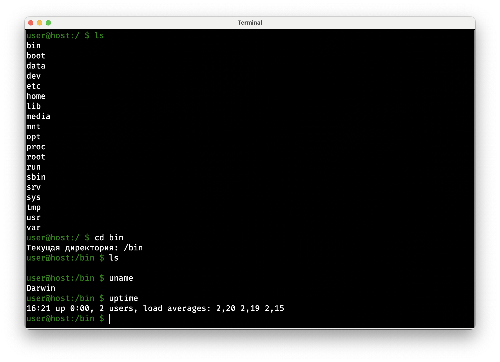

# Terminal Emulator



## Описание
Этот проект представляет собой эмулятор терминала с базовыми командами и функционалом записи логов в XML-файл. Поддерживается выполнение команд `ls`, `cd`, `uname`, `uptime` и их тестирование через модуль `unittest`.

## Возможности
- **Навигация по директориям** с использованием `cd`.
- **Просмотр содержимого директорий** с помощью `ls`.
- **Получение информации о системе** через `uname` и `uptime`.
- **Запись всех действий пользователей** в лог-файл `logs.xml` в формате XML с отметкой времени.
- **Тестирование функционала** команд с использованием юнит-тестов.

## Установка и запуск
1. Убедитесь, что у вас установлен Python 3.8 или выше.
2. Клонируйте репозиторий или загрузите проект.
3. Запустите с помощью команды python3 main.py `имя пользователя` `имя компьютера` `путь к файловой системе` `путь к файлу с логами` `путь к стартовому скрипту`:
    ### Пример
   ```zsh
   python3 main.py user myhost filesystem.zip logs.xml startup.sh
   ```
## Тестирование
Для тестирования работы программы была использована библоитека `unittest`
Были протестированы следующие функции:
- `ls`
- `cd`
- `uname`
- `uptime`
- `exit`
Для запуска тестов выполните команду
   ```zsh
   python3 -m unittest tests.py
   ```
Результат тестирования:

